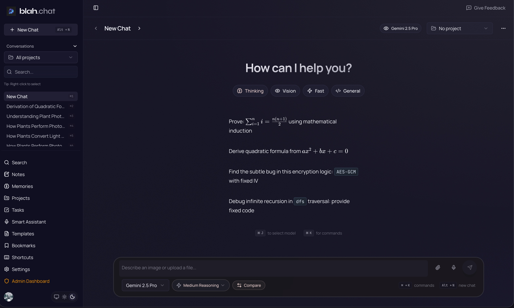

# blah.chat

Personal AI chat assistant with access to all models (OpenAI, Gemini, Claude, xAI, Perplexity, and more), mid-chat model switching, conversation branching, and transparent cost tracking.

[](./LICENSE)
[](https://vercel.com/new/clone?repository-url=https://github.com/bhekanik/blah.chat&integration-ids=oac_VqOgBHqhEoFTPzGZ8ZzE1Qsa,oac_7yeSwUoVR5no3SlA9WM6oZ7l)
[](https://railway.app/template/blah-chat)

## ✨ Features

- **All Models in One Place**: Access GPT-5, Claude Opus 4.5, Gemini 2.5 Pro, Grok, and 50+ models via Vercel AI Gateway
- **Mid-Chat Model Switching**: Compare responses or switch models without losing context
- **Conversation Branching**: Fork conversations to explore different directions
- **Resilient Generation**: Responses survive page refresh, tab close, even browser crashes
- **RAG Memory**: Automatic semantic memory extraction and retrieval
- **Voice Input**: Audio transcription with Whisper (OpenAI/Groq)
- **AI Tools**: Web search (Tavily), code execution (E2B), URL parsing (Jina)
- **Cost Tracking**: Per-message token usage and cost breakdown
- **Real-Time Collaboration**: Multi-user projects with live sync (via Convex)

## 📸 Preview

<table>
  <tr>
    <td width="50%">
      
      <p align="center"><em>Dark mode</em></p>
    </td>
    <td width="50%">
      
      <p align="center"><em>Light mode</em></p>
    </td>
  </tr>
</table>

## 🔑 Required API Keys

blah.chat requires API keys for certain features:

### Core Features (Required)

- **`AI_GATEWAY_API_KEY`** - Vercel AI Gateway for all AI model access

### Speech Features (Optional)

#### Speech-to-Text (STT)

Requires ONE of the following providers (configured by admin in Settings):

- **`GROQ_API_KEY`** - Groq Whisper Turbo (default, $0.04/hour)
- **`OPENAI_API_KEY`** - OpenAI Whisper ($0.006/min)
- **`DEEPGRAM_API_KEY`** - Deepgram Nova-3 ($0.0077/min)
- **`ASSEMBLYAI_API_KEY`** - AssemblyAI ($0.0025/min)

#### Text-to-Speech (TTS)

- **`DEEPGRAM_API_KEY`** - Deepgram Aura voices (required)

**Note:** If STT/TTS API keys are not configured, these features will be automatically disabled. Users will see an error message when attempting to enable them:

- **Development**: Specific missing key name shown
- **Production**: "Please contact your administrator" message

See the [Self-Hosting Guide](SELF_HOSTING.md) for full environment variable setup.

## 🚀 Quick Deploy

### Vercel (Recommended - 10 minutes)

[](https://vercel.com/new/clone?repository-url=https://github.com/bhekanik/blah.chat&integration-ids=oac_VqOgBHqhEoFTPzGZ8ZzE1Qsa,oac_7yeSwUoVR5no3SlA9WM6oZ7l)

Auto-configures Convex and Clerk integrations. Just add your `AI_GATEWAY_API_KEY`.

### Railway (10 minutes)

[](https://railway.app/template/blah-chat)

Railway auto-detects environment variables and guides you through setup.

### Self-Hosting

For full instructions on self-hosting (including Fly.io, custom VPS, Docker), see [SELF_HOSTING.md](./SELF_HOSTING.md).

## 📄 License

blah.chat is licensed under the [GNU Affero General Public License v3.0 (AGPL-3.0)](./LICENSE).

**Self-hosted usage**: Free under AGPL-3.0 with default limits (50 messages/day, $10/month budget per user).
**Commercial usage** (exceeding limits or without source disclosure): Requires commercial license.
**Cloud version**: Coming soon with subscription plans.

For commercial licensing or questions, contact: blah.chat@bhekani.com

### Why AGPL?

We chose AGPL to:

- Protect the community from exploitation by cloud providers
- Ensure improvements are shared back with the community
- Allow free self-hosting while building a sustainable business

If you modify blah.chat and run it as a network service, AGPL Section 13 requires you to provide users with access to your modified source code.

---

## Development Setup

### 1. Environment Variables

Copy the example environment file:

```bash
cp .env.local.example .env.local
```

You will need to configure the following API keys in `.env.local`:

**Core Services**

- **Vercel AI Gateway** (`AI_GATEWAY_API_KEY`): Required for all AI model inference.
- **Clerk** (`NEXT_PUBLIC_CLERK_PUBLISHABLE_KEY`, `CLERK_SECRET_KEY`, `CLERK_ISSUER_DOMAIN`): For user authentication and Convex integration.
- **Convex** (`NEXT_PUBLIC_CONVEX_URL`, `CONVEX_DEPLOYMENT`): Backend database and functions (configured automatically via `bunx convex dev`).

**AI Tools & Integrations**

- **Tavily** (`TAVILY_API_KEY`): Enables real-time web search capabilities.
- **Jina** (`JINA_API_KEY`): Used by the URL Reader tool to parse web pages into markdown.
- **E2B** (`E2B_API_KEY`): Powers the code interpreter sandbox for executing code safely.
- **Firecrawl** (`FIRECRAWL_API_KEY`): Optional alternative for advanced web scraping/crawling.
- **OpenAI** (`OPENAI_API_KEY`): Needed for audio transcription (Whisper) if not using Groq.

### 2. Convex Environment Variables

The backup backend (Convex) requires these variables to be configured in the [Convex Dashboard](https://dashboard.convex.dev):

- **`AI_GATEWAY_API_KEY`**: Vercel AI Gateway key for model access within Convex actions.
- **`CLERK_ISSUER_DOMAIN`**: Your Clerk Frontend API URL (e.g., `your-app.clerk.accounts.dev`).
- **`POSTHOG_API_KEY`**: API key for server-side analytics tracking.

> **Tip**: You can also set these via the CLI: `bunx convex env set AI_GATEWAY_API_KEY your_key_here`

### 3. Clerk Webhook Setup

Clerk webhooks sync user data to Convex. **Without this, users will hit an infinite redirect loop on their first sign-in.**

#### Local Development (Tunnel Required)

Since Clerk needs to reach your local server, set up a tunnel:

1. **Start a tunnel** (choose one):

   ```bash
   # Using ngrok
   ngrok http 3000

   # Using cloudflared
   cloudflared tunnel --url http://localhost:3000
   ```

2. **Configure webhook in Clerk Dashboard**:
   - Go to [Clerk Dashboard](https://dashboard.clerk.com) → Webhooks → Add Endpoint
   - Set endpoint URL: `https://your-tunnel-url.ngrok.io/api/webhooks/clerk`
   - Subscribe to events: `user.created`, `user.updated`, `user.deleted`
   - Copy the **Signing Secret**

3. **Add to `.env.local`**:

   ```bash
   CLERK_WEBHOOK_SECRET=whsec_your_signing_secret_here
   CLERK_ISSUER_DOMAIN=your-clerk-frontend-url.clerk.accounts.dev
   ```

   **Important**: `CLERK_ISSUER_DOMAIN` is your Clerk Frontend API URL (found in Clerk Dashboard → API Keys → Frontend API). Format: `your-app-name.clerk.accounts.dev` for development, `clerk.yourdomain.com` for production.

> **Tip**: Use a **static ngrok URL** (free tier includes one) to avoid reconfiguring the webhook each session:
>
> ```bash
> ngrok http 3000 --domain=your-static-subdomain.ngrok-free.app
> ```
>
> Set this up once in the Clerk dashboard and you're done.

### 4. Clerk JWT Template Setup

**Required for Convex integration**: Configure Clerk to generate JWTs for Convex.

1. **Create JWT Template**:
   - Go to [Clerk Dashboard](https://dashboard.clerk.com) → **JWT templates**
   - Click **New template** → Select **Convex**
   - Copy the **Issuer** URL (this matches your `CLERK_FRONTEND_API_URL`)

2. **Verify Claims** (pre-configured for Convex):
   - `aud`: Convex audience (auto-set)
   - `name`: User's full name from `user.full_name`
   - Add any additional claims as needed using [shortcodes](https://clerk.com/docs/guides/sessions/jwt-templates#shortcodes)

3. **Configure Convex Auth**:
   Your `convex/auth.config.ts` should reference the environment variable:
   ```ts
   export default {
     providers: [
       {
         domain: process.env.CLERK_ISSUER_DOMAIN,
         applicationID: "convex",
       },
     ],
   };
   ```

**Note**: `CLERK_ISSUER_DOMAIN` should be set without protocol (e.g., `your-app-name.clerk.accounts.dev`, not `https://your-app-name.clerk.accounts.dev`).

**Reference**: For complete Convex + Clerk integration guide, see [Clerk Documentation](https://clerk.com/docs/guides/development/integrations/databases/convex).

**Note**: The `applicationID: 'convex'` is correct - it's a constant identifier, not your deployment name.

### 5. Admin Access Setup (Optional)

To access the admin dashboard (`/admin`):

1. **Set yourself as admin** in Convex Dashboard → Data → `users` table → set `isAdmin: true`
2. **Sync to Clerk**:
   ```bash
   bun run scripts/sync-admin-to-clerk.ts
   ```
3. **Sign out and back in** to refresh your session token.

Future admin changes via `/admin/users` auto-sync to Clerk.

### 6. Seed the Database with Models

**Required for new deployments**: The models table must be seeded before the app can function.

Run the seed command via Convex dashboard or CLI:

```bash
# Via Convex CLI (recommended)
bunx convex run models/seed:seedModels

# Or with clear existing (resets all model data)
bunx convex run models/seed:seedModels '{"clearExisting": true}'
```

This inserts:
- 40+ AI models (GPT-5, Claude, Gemini, etc.)
- Model profiles for auto-router scoring
- Default auto-router configuration

**When to seed:**
- Initial deployment (required)
- After `bunx convex deploy --reset`
- When new models are added to `packages/backend/convex/models/seed.ts`

### 7. Run Locally

1. Install dependencies:

   ```bash
   bun install
   ```

2. Start the Convex backend (in a separate terminal):

   ```bash
   bunx convex dev
   ```

3. Start the Next.js development server:
   ```bash
   bun dev
   ```

Open [http://localhost:3000](http://localhost:3000) to see the app.
