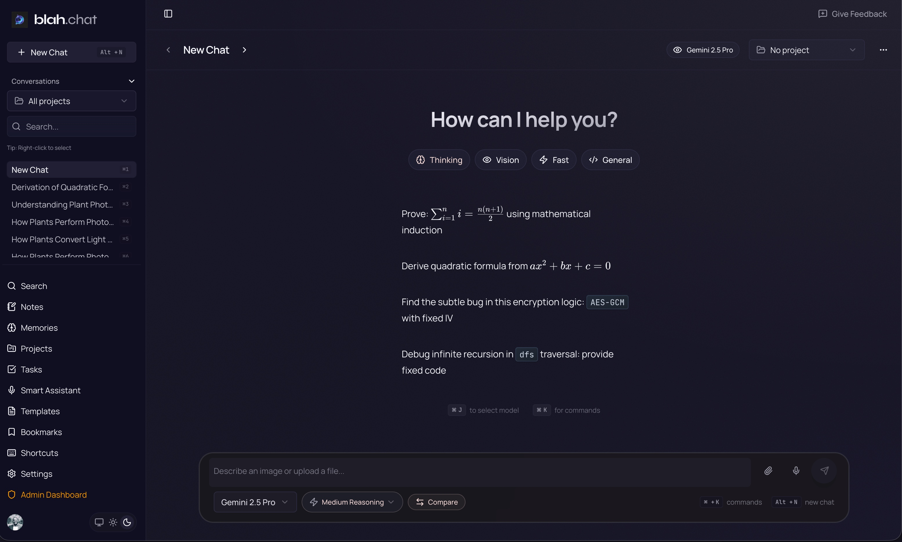
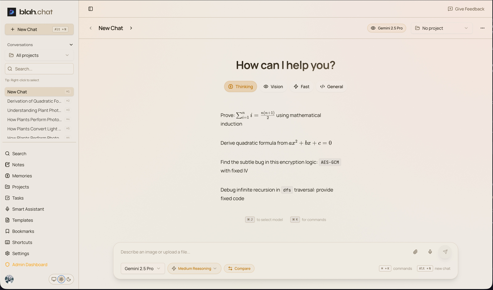

# blah.chat

Personal AI chat assistant with access to all models (OpenAI, Gemini, Claude, xAI, Perplexity, and more), mid-chat model switching, conversation branching, and transparent cost tracking.

[](./LICENSE)
[](https://vercel.com/new/clone?repository-url=https://github.com/bhekanik/blah.chat)
[](https://railway.app/template/blah-chat)

## ✨ Features

- **All Models in One Place**: Access GPT-5, Claude Opus 4.5, Gemini 2.5 Pro, Grok, and 50+ models via Vercel AI Gateway
- **Mid-Chat Model Switching**: Compare responses or switch models without losing context
- **Conversation Branching**: Fork conversations to explore different directions
- **Resilient Generation**: Responses survive page refresh, tab close, even browser crashes
- **RAG Memory**: Automatic semantic memory extraction and retrieval
- **Voice Input**: Audio transcription with Whisper (OpenAI/Groq)
- **AI Tools**: Web search (Tavily), code execution (E2B), URL parsing (Jina)
- **Cost Tracking**: Per-message token usage and cost breakdown
- **Shared Workspaces**: Multi-user projects, shared conversations, and project notes

## 💻 CLI

Chat with AI models directly from your terminal.

### Install

```bash
# Shell (macOS/Linux)
curl -fsSL https://blah.chat/install | bash

# npm
npm i -g @blah-chat/cli

# Homebrew (coming soon)
brew install planetaryescape/tap/blah
```

### Usage

```bash
# First time: authenticate via browser
blah login

# Start chatting
blah "What is the capital of France?"
blah --model claude-3-opus "Explain quantum computing"
blah --help
```

## 📸 Preview

<table>
  <tr>
    <td width="50%">
      
      <p align="center"><em>Dark mode</em></p>
    </td>
    <td width="50%">
      
      <p align="center"><em>Light mode</em></p>
    </td>
  </tr>
</table>

## 🔑 Required API Keys

blah.chat requires API keys for certain features:

### Core Features (Required)

- **`AI_GATEWAY_API_KEY`** - Vercel AI Gateway for all AI model access

### Speech Features (Optional)

#### Speech-to-Text (STT)

Requires ONE of the following providers (configured by admin in Settings):

- **`GROQ_API_KEY`** - Groq Whisper Turbo (default, $0.04/hour)
- **`OPENAI_API_KEY`** - OpenAI Whisper ($0.006/min)
- **`DEEPGRAM_API_KEY`** - Deepgram Nova-3 ($0.0077/min)
- **`ASSEMBLYAI_API_KEY`** - AssemblyAI ($0.0025/min)

#### Text-to-Speech (TTS)

- **`DEEPGRAM_API_KEY`** - Deepgram Aura voices (required)

**Note:** If STT/TTS API keys are not configured, these features will be automatically disabled. Users will see an error message when attempting to enable them:

- **Development**: Specific missing key name shown
- **Production**: "Please contact your administrator" message

See the [Self-Hosting Guide](SELF_HOSTING.md) for full environment variable setup.

## 🚀 Quick Deploy

### Docker Compose

Run the web app plus Postgres, Redis, Redis HTTP, and MinIO locally:

```bash
cp docker/env.example .env.docker
# Edit .env.docker with real Clerk, AI Gateway, and Trigger.dev values.
BLAH_CHAT_ENV_FILE=.env.docker docker compose up
```

See [`docker/README.md`](./docker/README.md) and [`SELF_HOSTING.md`](./SELF_HOSTING.md).

### Vercel

[](https://vercel.com/new/clone?repository-url=https://github.com/bhekanik/blah.chat)

Provision Postgres, Redis, R2-compatible storage, Clerk, and Trigger.dev first, then set the production environment variables from [`docs/operations/production-env-checklist.md`](./docs/operations/production-env-checklist.md).

### Railway

[](https://railway.app/template/blah-chat)

Railway can host the web app, but you still need to provide the same Postgres, Redis, R2-compatible storage, Clerk, and Trigger.dev environment variables.

### Self-Hosting

For Docker Compose self-hosting/local dev, see [`docker/README.md`](./docker/README.md). For full instructions on self-hosting, see [SELF_HOSTING.md](./SELF_HOSTING.md).

## 📄 License

blah.chat is licensed under the [GNU Affero General Public License v3.0 (AGPL-3.0)](./LICENSE).

**Self-hosted usage**: Free under AGPL-3.0 with default limits (50 messages/day, $10/month budget per user).
**Commercial usage** (exceeding limits or without source disclosure): Requires commercial license.
**Cloud version**: Coming soon with subscription plans.

For commercial licensing or questions, contact: blah.chat@bhekani.com

### Why AGPL?

We chose AGPL to:

- Protect the community from exploitation by cloud providers
- Ensure improvements are shared back with the community
- Allow free self-hosting while building a sustainable business

If you modify blah.chat and run it as a network service, AGPL Section 13 requires you to provide users with access to your modified source code.

---

## Development Setup

### Option A: Docker Compose

This is the cleanest local setup because it runs the app and infrastructure in one compose project:

```bash
cp docker/env.example .env.docker
# Edit .env.docker with real external service keys.
BLAH_CHAT_ENV_FILE=.env.docker docker compose up
```

Open [http://localhost:3000](http://localhost:3000).

Run the Trigger.dev worker container when you have Trigger auth configured:

```bash
BLAH_CHAT_ENV_FILE=.env.docker docker compose --profile jobs up
```

### Option B: Bun on Host, Infra in Docker

Start dependencies only:

```bash
docker compose -f docker-compose.dev.yml up -d
```

Create host env and run the app:

```bash
cp docker/env.example .env.local
# Edit .env.local with real external service keys.
bun install
bun run db:migrate
bun dev
```

Open [http://localhost:3000](http://localhost:3000).

### Required Services

**Core Services**

- **Vercel AI Gateway** (`AI_GATEWAY_API_KEY`): Required for all AI model inference (or every user must enable BYOK).
- **Clerk** (`NEXT_PUBLIC_CLERK_PUBLISHABLE_KEY`, `CLERK_SECRET_KEY`, `CLERK_ISSUER_DOMAIN`, `CLERK_WEBHOOK_SECRET`): User authentication and webhook user-sync.
- **Postgres** (`DATABASE_URL`): Primary database — Neon recommended in production.
- **Upstash Redis** (`UPSTASH_REDIS_REST_URL`, `UPSTASH_REDIS_REST_TOKEN`): Live generation event log and cache.
- **Cloudflare R2** (`R2_ACCOUNT_ID`, `R2_ACCESS_KEY_ID`, `R2_SECRET_ACCESS_KEY`, `R2_BUCKET`): Attachment + transcription storage.
- **Trigger.dev** (`TRIGGER_SECRET_KEY`, `TRIGGER_API_URL`, `INTERNAL_TASK_SECRET`, `INTERNAL_TASK_BASE_URL`): Durable generation workers and recovery cron.
- **Encryption** (`BYOD_ENCRYPTION_KEY`): Encrypts user BYOK provider keys and BYOD connection strings — long-lived, do not rotate without re-encrypting stored credentials.

**AI Tools & Integrations**

- **Tavily** (`TAVILY_API_KEY`): Enables real-time web search capabilities.
- **Jina** (`JINA_API_KEY`): Used by the URL Reader tool to parse web pages into markdown.
- **E2B** (`E2B_API_KEY`): Powers the code interpreter sandbox for executing code safely.
- **Firecrawl** (`FIRECRAWL_API_KEY`): Optional alternative for advanced web scraping/crawling.
- **OpenAI** (`OPENAI_API_KEY`): Needed for audio transcription (Whisper) if not using Groq.

### Production Environment Checklist

See [`docs/operations/production-env-checklist.md`](./docs/operations/production-env-checklist.md)
for the canonical list derived from `parsePersistenceEnv`. Before promoting
to production, every "Required" entry must be set and `/api/v1/health` must
return `200` with `database`, `redis`, `r2`, and `trigger` all `"ok"`.

### Clerk Webhook Setup

Clerk webhooks sync user data into Postgres. Without this, first sign-in may fail until the app can fetch and create the user from Clerk.

#### Local Development (Tunnel Required)

Since Clerk needs to reach your local server, set up a tunnel:

1. **Start a tunnel** (choose one):

   ```bash
   # Using ngrok
   ngrok http 3000

   # Using cloudflared
   cloudflared tunnel --url http://localhost:3000
   ```

2. **Configure webhook in Clerk Dashboard**:
   - Go to [Clerk Dashboard](https://dashboard.clerk.com) → Webhooks → Add Endpoint
   - Set endpoint URL: `https://your-tunnel-url.ngrok.io/api/webhooks/clerk`
   - Subscribe to events: `user.created`, `user.updated`, `user.deleted`
   - Copy the **Signing Secret**

3. **Add to your env file (`.env.docker` or `.env.local`)**:

   ```bash
   CLERK_WEBHOOK_SECRET=whsec_your_signing_secret_here
   CLERK_ISSUER_DOMAIN=your-clerk-frontend-url.clerk.accounts.dev
   ```

   **Important**: `CLERK_ISSUER_DOMAIN` is your Clerk Frontend API URL (found in Clerk Dashboard → API Keys → Frontend API). Format: `your-app-name.clerk.accounts.dev` for development, `clerk.yourdomain.com` for production.

> **Tip**: Use a **static ngrok URL** (free tier includes one) to avoid reconfiguring the webhook each session:
>
> ```bash
> ngrok http 3000 --domain=your-static-subdomain.ngrok-free.app
> ```
>
> Set this up once in the Clerk dashboard and you're done.

### Admin Access Setup (Optional)

To access the admin dashboard (`/admin`):

1. In Clerk Dashboard, set your user's `publicMetadata.isAdmin` to `true`.
2. Sign out and back in to refresh your session token.

Future admin changes via `/admin/users` auto-sync to Clerk.

### Health Check

After startup, check:

```bash
curl http://localhost:3000/api/v1/health
```

For full functionality, `database`, `redis`, `r2`, and `trigger` should all report `ok`.
